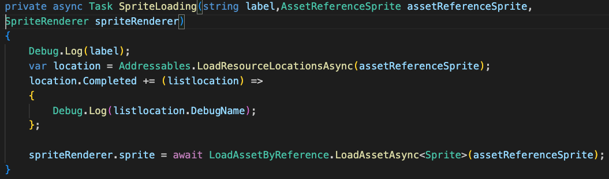
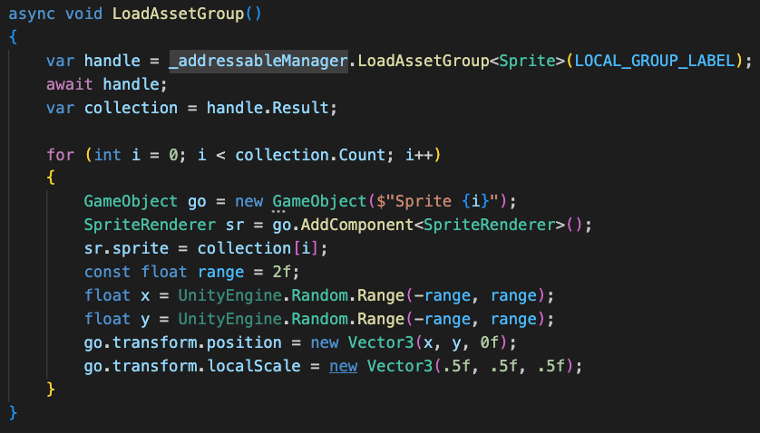

# Addressables-loader

## Getting started

- Import addressables package through package manager
- Initial addressables settings and groups:
Windows -> Asset managment -> Addressables -> Groups -> Create addressables settings
- In AddressableAssetsData/AddressableAssetSettings.asset -> Catalog/Build Remote Catalog set to true and Catalog/Build&LoadPaths to local (no matter if you want to use remote or local paths for your assets.)

## Profiles

In profiles we can setup Build/LoadPath.
- Remote.BuildPath - remote build path to the file (URL)
- Remote.LoadPath - remote load path to the file (URL)
- Local.BuildPath -  local build path (in most case Built-in)
- Local.LoadPath - local load path (in most case Built-in)

In this case (image above) we don't need to setup many profiles. In Remote.LoadPath we use [BuildTarget] folder which automatically change it's name based on target operating system (Build Profiles).
For the local path for every kind of build we want to built these packages into project.

## Setup profiles

[//]: <> (Each profile is created to define different build target and desired build and load paths for this target.
Therefore it is important to have seperate profiles or path pairs both for iOS and Android.
It can come in handy to have additional pair of profile paths for production, developement and local for editor.)

To setup profiles and paths go to Windows -> Asset management -> Addressables -> Profiles
To specify custom paths click on drop down in path pairs and select custom
. 
To use remotly loaded addressables, specify load path to target the root folder of asset bundles at the server, 
for example: https://assets.r5y.io/mwo/asset_bundles
the hierarchy of bundles at the server should be the same as at build location.
Build path can direct to some outside folder, to avoid including bundles in project repo.

To use specified profile, go to project hierarchy and find scriptable object with addressables settings, default name is: AddressableAssetSettings.
Select checkbox "Build Remote Catalog" and find previously created profile and paths from dropdown.

## Configuring addressable groups

It is important to select correct build and load paths for each group seperatly.

While working with remotly loaded bundles it might be important and useful to specify some request timeout, as well, as retry count.

### Useful informations about addressables groups

Each addressable group is seperatly builded asset bundle.
While working and preparing groups keep in mind few importnant things.
1. While atleast one asset from bundle is referenced, the entire bundle is held in memory, and it will remain there until all references from it are released. That is why proper organization of bundles is important. 
2. It might be necessary to specify which bundles should be split to smaller and bigger ones. It is better load bigger bundles at the game start if we know that it will be referenced at all times during the game session. Meanwhile the smaller ones can be loaded adhoc as long since their load time is faster, and can be released if necessary.
Just remember the rule:
- big bundles loaded at start
- small bundles to load at runtime
3. The game should assure that users with worse internet connection have all necessary bundles loaded at the game start to avoid having load times and missing assets during session.
4. Each bundle group can use bundle cache. By default it is always set to true, but can be changed if necessary. For example, for event screen to not overload cache disk memory with unused assets.
5. To have better control and insights about what's included in the bundle remember to use bundle mode set to pack separatly

### Loading assets from bundles and referncing them
1. Each asset from bundles can be referenced by string - key which is its relative path, string - label similar to GameObject tags or specific type - AssetReference.
2. AssetReference can specify type which is expected, therefore it is the safest option to use, for example ASsetReferenceSprite. AssetReference is a weak type reference and is not loaded to memory until forced to.
3. Labels - each asset in bundle can have specified label. You can load multiple assets from different bundles only by label.
4. To change the path from local to remote, you need to go to AddressableAssetSettings and change the Build&Load paths there.

4. Assets in bundle can be organized in folders to simplify control over many assets at once. Entire folder can be dragged and dropped into the bundle.

5. The addressable system prevents using the same asset in different groups. Therefore if you will try to add the same asset to different group, in fact it will move from one group to another, and not be duplicated.

## Building and versioning

To build bundles simply navigate to Addressables Groups and click Build->New build->"your build script"

The build will be localized at specified build path.
Each build will contain auto generated files like catalog_0.1.hash and catalog_0.1.json which contains information about referenced assets, and paths to them, and needs to be included at remote load path.
Addressables_Content_State.bin is not required to be uploaded to your load path. 
The number at the end of catalog files "0.1" is the build version number. Remember that only the latest asset bundle will be loaded, if you have duplicates for the same build version the will be ignored. So if you want to perform asset update for already published version you need to replace all of the files at the load path.
Autogenerated names for groups can be controlled in the settings of each group.

Since each bundle is assigned to different build version, bundles should be organized by build version. 

## Configuring for Remote/Local
If we want Remote/Local paths/groups at the same time:
1. Set Remote mode in Addressable Asset Settings then build this package.
2. Push it to the server (remember to use correct URL on current profile). 
3. Change to local mode in Addressable Asset Settings and build this package. (In most cases Built-in option on your current profile)
TIP: For this setup I highly recommend disabling Build Addressables On Player Build because we need to build these two packages anyway so the best way to do this is manually.

Recommended setup for local group:

Recommended setup for remote group:

## Getting assets - code examples

Getting asset by Task:

Getting asset by Callback:

Getting assets by label:

Example of loading sprite:

Example of loading multiple sprites by label:

Handling operation results:

